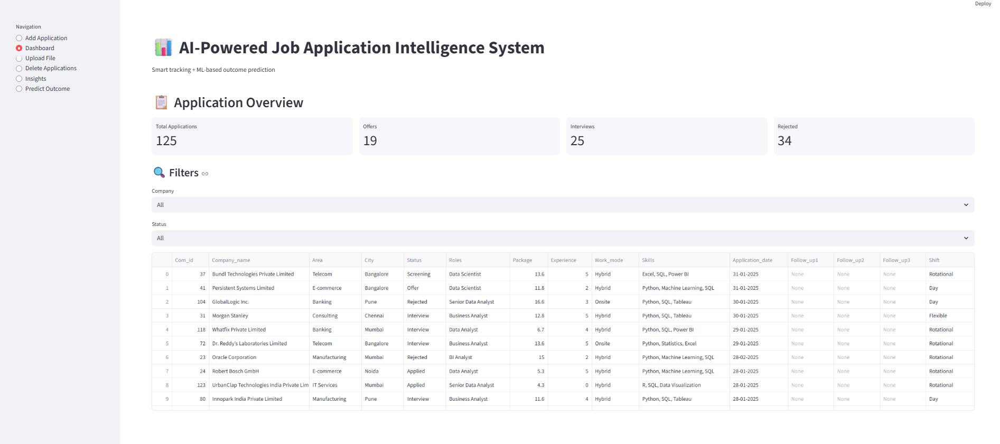
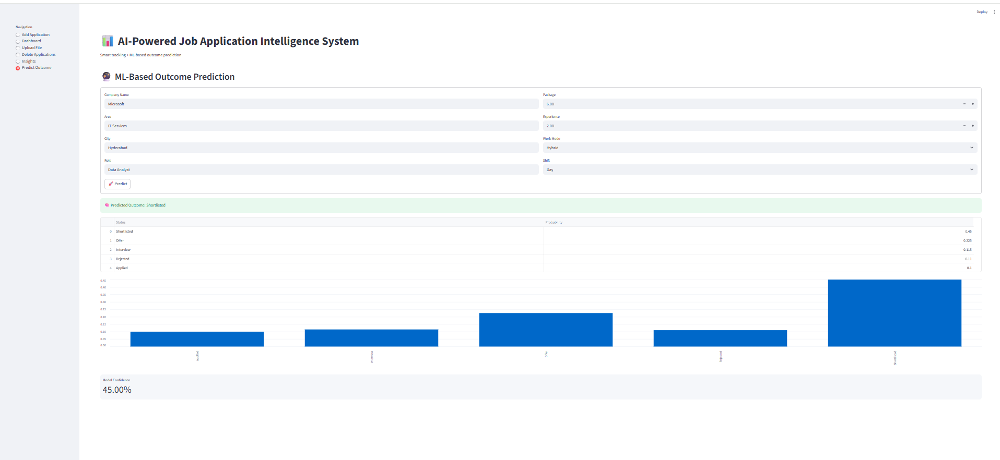
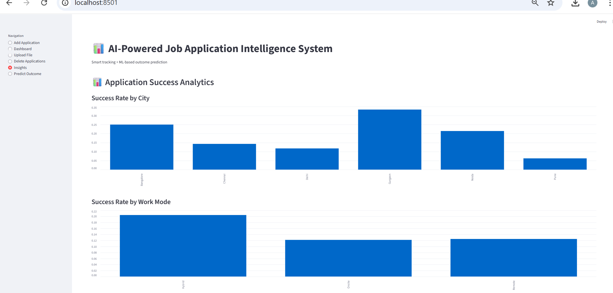

# 📊 AI Job Application Intelligence System

A Streamlit-powered dashboard to **track job applications**, **analyze success rates**, and **predict outcomes** using machine learning.  
This project combines **SQLite**, **Pandas**, and **Scikit-learn** with an interactive UI for smarter career management.

---

## 🚀 Features

- ➕ **Add Applications**: Store company, role, package, experience, and status.
- 📋 **Dashboard**: View total applications, offers, interviews, and rejections with filters.
- 📂 **Upload Files**: Import applications from CSV/Excel with schema validation.
- 🗑️ **Delete Applications**: Remove single or all records easily.
- 📊 **Insights**: Success analytics by city and work mode.
- 🔮 **Predict Outcome**: ML-powered prediction of application results with confidence scores.

---

## 🛠 Tech Stack

- **Frontend/UI**: [Streamlit]
- **Database**: [SQLite]
- **Data Handling**: [Pandas]
- **Machine Learning**: [Scikit-learn] [RandomForestClassifier]
- **Model Persistence**: [Joblib]

---

## ▶️ Run Locally

Clone the repository and install dependencies:

```bash
git clone https://github.com/Ankith-Kulkarni/AI-Job-Application-Intelligence.git
cd AI-Job-Application-Intelligence
pip install -r requirements.txt
streamlit run app.py


## 📸 Screenshots

### Dashboard


### Prediction Output


### Analytics

